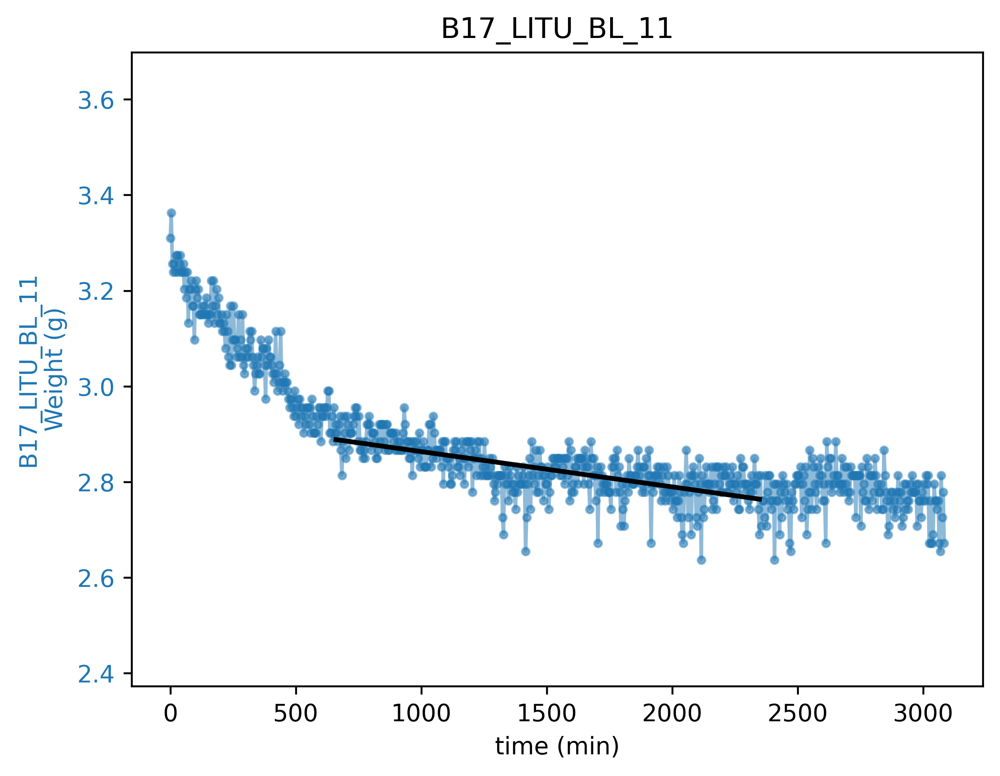
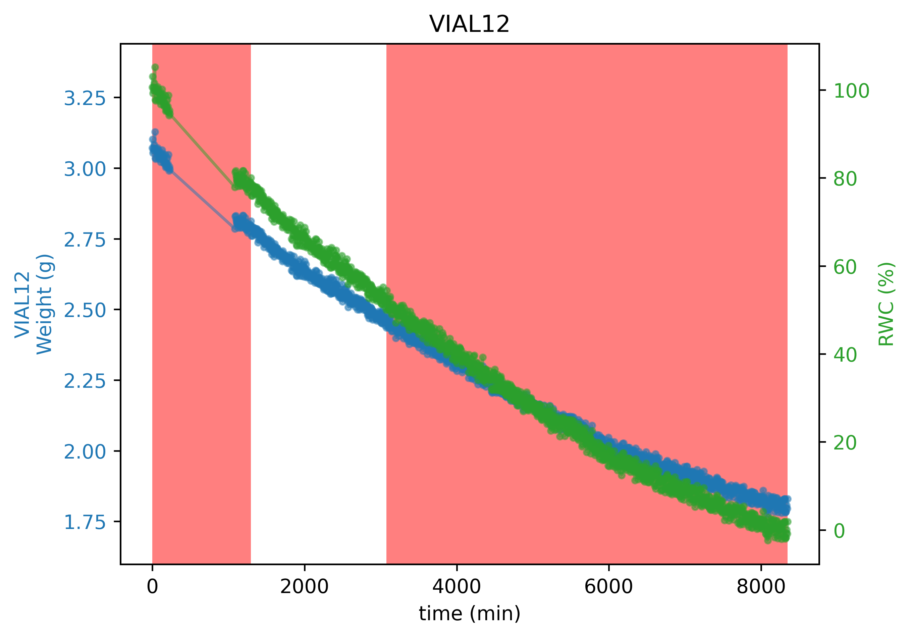

# Python Program for computing leaf conductance

Current version is: **0.2**

## Program flow

#### Step 1
1. The program ask to chose:
    - A folder that will be parsed 
    - Some unique ID from a single file

The program writes the number of files found

#### Step 2
2. You have to chose which method you will use:
    - Select time interval manually then compute gmin in the interval time
    - Filtering the data based on RWC and then compute gmin in the interval time

#### Step 3 - Option 1
3. If you chose the manual points selection:
    - You have to select two points on the curve
    - Gmin is computed based on a linear regression between these two points

#### Step 3 - Option 2
4. If you chose the method based on RWC:
    - the semi auto method will plot curve each time
    - the full auto will precede to the gmin computation automatically

5. The data are first filtered based on RWC:

Default values for the RWC filtering are 80% and 50%, but thsi can be changed manually:
>
> python gminExec.py --rwc_sup 90 --rwc_inf 20 # Superior threshold : 90%, inferior : 20%  
> 
> python gminExec.py -rs 90 -ri 20 # It is a shortcut for the code above
>

6. Gmin is computed based on a linear regression between the two boundaries of the RWC filtered data

#### Step 5
7. Synthetic figures and data frames are saved within the output_fig and output_files folder

   

## Data format

Data must be stored within files
For a better files recognition, first row of the csv file should contain the string "conductance" otherwise all csv from a folder will be parsed

Columns should be named as follows:

#### Quantitative columns

- weight_g : leaf weight as a function of time (g)
- T_C : temperature (°C)
- RH : Relative Humidity
- Patm : atmospheric pressure (KPa)
- Area_m2 : area of the leaf (m2)

#### Qualitative columns

- campaign : campaign name
- sample_ID : ID of the sample, should be unique for each sample

#### Date

- date_time : time **(best with the format YEAR/MONTH/DAY HOUR:MINUTE )**

   

## How to install?

### Install Python version if needed

[Anaconda](https://www.anaconda.com/products/individual)

[Miniconda](https://docs.conda.io/en/latest/miniconda.html)

### Download full folder from git

1. Direct download

From the green box  named 'clone' in the right corner > download .zip

2. From the terminal

>
> git clone https://github.com/xbouteiller/gminComputation.git
>

### Install dependencies

>
> pip install -r requirements.txt 
>

### Install package

Open a terminal in the DetectEvent folder, then :

>
> python setup.py develop
>

### Program Execution

Copy the file **gminExec.py** in the desired folder

Then open a terminal 

>
> python gminExec.py
>

### Installing updates

>
> git pull origin main
>
> python setup.py develop
>

