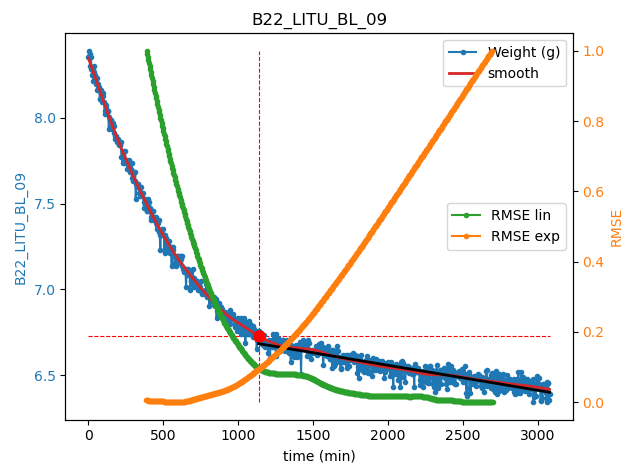

# Python Program for computing leaf conductance and detecting curve's changing point

Current version is: **1.7**

## What's new in this release ?

### Major changes

##### 2021/04/01
- Data file are sliced based on Relative Water Content (RWC)
- RWC = 100*((fresh-dry)/(saturated-dry))
- It is possible to manually define superior and inferior threshold for slicing the data (default: 80% and 50%)

>
> python Leaf_exec.py --rwc_sup 90 --rwc_inf 20 # Superior threshold : 90%, inferior : 20%  
> 
> python Leaf_exec.py -rs 90 -ri 20 # It is a shortcut for the code above
>

Eliminated data are highlighted in red

- RWC defined thresholds and corresponding time are stored within the .csv recap file
- If you want to keep the complete dataset you can choose to keep the values between RWC sup 100% and RWC inf 0%

>
> python Leaf_exec.py --rwc_sup 100 --rwc_inf 0 
>

##### 2021/03/25
- It is now possible to select only some ID from a file 

Choose the option 2 when the program starts: select some ID from a file. 

It is now possible to analyse only the selected ID (one or more).

   

##### 2021/03/20
- RMSE change detection method is implemented on differentiated signal
- Figures are automatically saved to output_fig folder
- Arg parser was added : It can be used in order to define manually some parameters before computation
- More specifically, following arguments may be useful:
    - transfo_diff & transfo_diff
        - Allow to transform the data before fitting a model on it
        - rmse: refers to the RMSE method, diff refers to the differentiation method
        - choice are **1**, **2**, **3** & **4**
            - 1: No transformation
            - 2: log() the data from the end
            - 3: 1/exp() the data from the beginning
            - 4: both log() the data from the end and 1/exp() the data from the beginning
    - fit_exp_rmse & fit_exp_diff
        - Allow to chose the shape of the model fitted on the data **from the beginning** for calculating RMSE (from the end, it is always a linear model that is fitted)
        - rmse: refers to the RMSE method, diff refers to the differentiation method
        - choice are **1** or **2**,
            - 1: fit the A*exp-B*t model from the beginning of the signal
            - 2: fit a linear model from the beginning of the signal
    

   
### Example of uses
Good results was obtained with the following configuration:

>
> python Leaf_exec.py --transfo_rmse 4 --fit_exp_rmse 2 --transfo_diff 2 --fit_exp_diff 2 
>

This is equivalent to:

> 
> python Leaf_exec.py -tr 4 -fr 2 -td 2 -fd 2 
>

That's mean:

- the 'raw' signal :
    - transformation of the raw measures with a log(y) when fitting model from the end to the start & and 1/exp(y) when fitting model from the start to the end
    - model fitted is only a linear regression 

- the 'differentiated' signal :
    - transformation of the raw measures with a log(y) when fitting model from the end to the start & and no transformation when fitting model from the start to the end
    - model fitted is only a linear regression 

In order to get the original method of the program (i.e. no data transformation & A*expt-B*t fitted when fitting model from start to end):
>
> python Leaf_exec.py
>

This is equivalent to:

>
> python Leaf_exec.py -tr 1 -fr 1 -td 1 -fd 1  
>

## Install Python version if needed

[Anaconda](https://www.anaconda.com/products/individual)

[Miniconda](https://docs.conda.io/en/latest/miniconda.html)

## Download full folder from git

1. Direct download

From the green box  named 'clone' in the right corner > download .zip

2. From the terminal

>
> git clone https://github.com/xbouteiller/DetectEvent.git
>

## Install dependencies

>
> pip install -r requirements.txt 
>

## Install package

Open a terminal in the DetectEvent folder, then :

>
> python setup.py develop
>

## Program Execution

Copy the file **Leaf_exec.py** in the desired folder

Then open a terminal 

>
> python Leaf_exec.py
>

## Installing updates

>
> git pull origin main
>
> python setup.py develop
>

## Program possibilities

#### RMSE approach

- Objective is to detect curve's changing point (i.e the point where the curve shift from an exponential function to a linear function)
- Exponential function is fitted from left to right and linear function is fitted from right to left
- Root Mean Squared Error (RMSE) is computed and it is expected that the 2 errors cross  approximately at the curve's changing point
- Several computed parameters are extracted and saved within a csv file (as Gmin)

#### Robust differential method

- Use a robust differential method (Chartrand, 2011) to compute conductance from raw data 
- Conductance is further differentiated in order to detect peak

## Data

Data must be stored within files
For a better files recognition, first row of the csv file should contain the string "conductance" otherwise all csv from a folder will be parsed

Columns should be named as follow

#### Quantitative columns

- weight_g : leaf weight as a function of time (g)
- T_C : temperature (°C)
- RH : Relative Humidity
- Patm : atmospheric pressure (KPa)
- Area_m2 : area of the leaf (m2)

#### Qualitative columns

- campaign : campaign name
- sample_ID : ID of the sample, should be unique for each sample

#### Date

- date_time : time (best with the format YEAR/MONTH/DAY HOUR:MINUTE )

## Program flow

#### Step 1
1. The program ask to chose a folder that will be parsed 

#### Step 2
2. A method for detecting conductancefiles must be chosen. There is two possibilities : either the program detect all .csv file or the program detect files containing the string "conductance" in the first row. Number of detected files within folder will be printed in the console.

### Step 3
3. You have to chose which method you will use: either the RMSE approach or the robust differential approach

The following steps are for the RMSE approach
#### Step 4
4. The software proposes to work on raw data or smoothed data. It is often preferable to work on smoothed data.

Smoothing parameters can be adjusted. See the lowess method from the statsmodels library. 

[Lowess help](https://www.statsmodels.org/stable/generated/statsmodels.nonparametric.smoothers_lowess.lowess.html)

#### Step 5
5. The program plot the detected crossing points, and print the value in the console.

Gmin is computed using a linear regression from the detected crossing point to the end of the data.

It is also possible to select manually on the graph 1 or 2 crossing points. if 2 points are selected, Gmin is computed between this 2 points. See the black line below.

#### Step 6
6. Other files & sample ID within each file are analyzed, then a output folder is created & a data frame is saved within this folder.

For the conductance approach. Step are very similar. It is also possible to work on raw or smoothed data. It is possbile to adjust the regularization parameters of the derivative function (see cited reference below). Then, peaks are detected, it is also possible to select the peaks manually. Please note that this method is still under development.

## References

> Chartrand, Rick. (2011). Numerical Differentiation of Noisy, Nonsmooth Data. ISRN Appl. Math.. 2011. 10.5402/2011/164564. 

[Original paper](https://www.hindawi.com/journals/isrn/2011/164564/)

[GitHub](https://github.com/xbouteiller/tvregdiff)